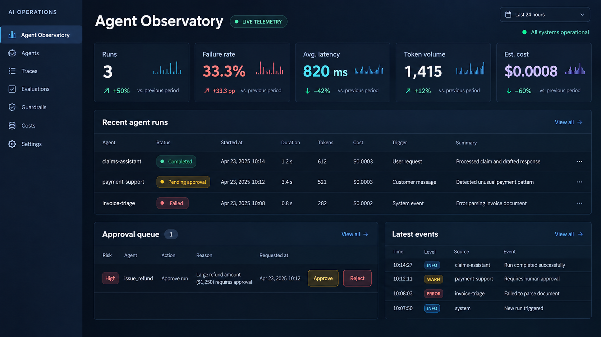
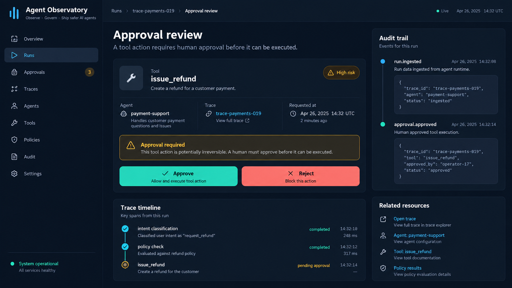
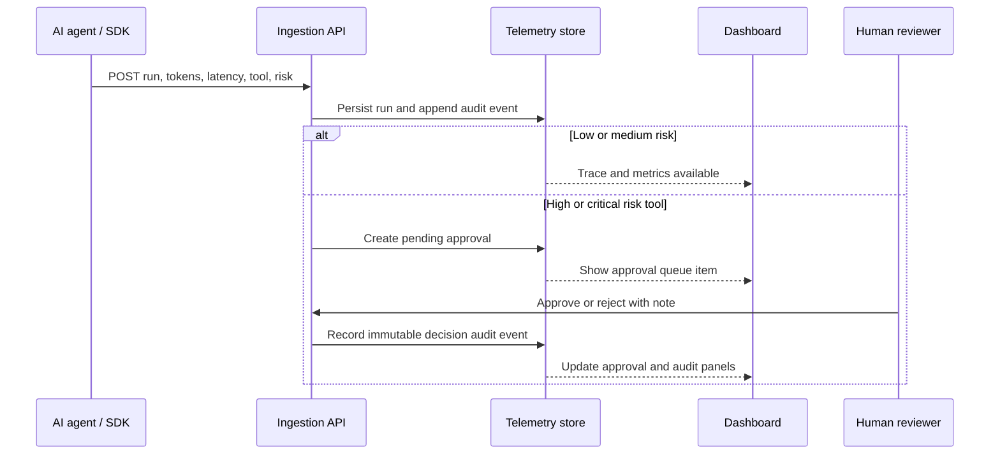

# AI Agent Observability Platform

Telemetry, evaluation, and approval controls for AI-agent workflows.

Python standard library, SQLite, and a browser dashboard. It runs locally without API keys or a cloud account.

## The problems this solves

| Problem | What goes wrong | What this does |
|---|---|---|
| **AI-agent failures and cost are invisible** | An agent gives a poor answer, times out, or becomes expensive—but the team cannot connect the failure to its prompt version, model, tool call, latency, token use, or trace. Debugging becomes guesswork. | Every run records its trace ID, agent, model, prompt version, tool, status, latency, tokens, estimated cost, and error. The dashboard turns this into a trace explorer and operating metrics. |
| **High-risk agent tools need human accountability** | An agent can attempt an irreversible action such as issuing a refund, sending an email, or changing customer data, with no reviewable decision trail. This creates security, compliance, and trust risk. | High- and critical-risk tool calls automatically enter an approval queue. An approve/reject decision, reviewer, note, and audit event are retained for review. |

Seeded data includes a failed `invoice-triage` run and a pending `issue_refund` approval so you can click through traces, cost, and the audit trail without sending a request first.

## What it does

- Ingests agent runs with model, prompt version, token, latency, tool-call, and error metadata
- Groups related work by trace ID and renders parent/child spans
- Calculates run volume, failure rate, average latency, token use, and estimated cost
- Creates approval records for `high` / `critical` risk actions
- Captures an append-only audit record for ingestion and approval decisions
- Avoids storing raw prompt/response text when a run is marked as containing PII

```text
Agent / SDK
    │ POST run telemetry
    ▼
Ingestion API ──► SQLite (runs, spans, approvals, audit)
    │                         │
    └─────────────────────────┴──► Dashboard / trace explorer / approval queue
```

## Demo screens and workflow

The screenshots use sample telemetry seeded on first run.

### 1. Operations dashboard

The dashboard provides a quick operational view: volume, failure rate, latency, estimated model cost, recent traces, pending approvals, and audit activity. Seeded rows include a failed `invoice-triage` run and a parent/child claims trace.



### 2. High-risk action review

When an agent requests a high- or critical-risk tool, the platform creates a pending approval. A reviewer can approve or reject it; either outcome is written to the audit feed. A decision updates the recorded run status. It does not execute the tool.



### Event flow



## Run locally

Requires Python 3.11+.

```powershell
cd "AI-Agent-Observability-Platform"
python apps/api/main.py
```

Open http://127.0.0.1:8300. The first run creates a local SQLite database and sample telemetry.

Docker (dashboard is included; the process listens on `0.0.0.0` inside the container):

```powershell
docker compose up --build
```

## API examples

Create a low-risk completed run:

```powershell
$body = @{
  agentName = "support-agent"
  traceId = "trace-support-104"
  model = "gpt-4.1-mini"
  promptVersion = "support-v3"
  status = "completed"
  latencyMs = 842
  inputTokens = 320
  outputTokens = 96
  toolName = "knowledge_search"
  riskLevel = "low"
  containsPii = $false
} | ConvertTo-Json

Invoke-RestMethod http://127.0.0.1:8300/api/v1/runs -Method Post -ContentType 'application/json' -Body $body
```

High-risk input creates a pending approval automatically:

```json
{
  "agentName": "claims-agent",
  "traceId": "trace-claims-7",
  "status": "pending_approval",
  "toolName": "issue_refund",
  "riskLevel": "high",
  "latencyMs": 210,
  "inputTokens": 120,
  "outputTokens": 30
}
```

| Endpoint | Purpose |
|---|---|
| `GET /api/v1/metrics` | Operations dashboard metrics |
| `GET /api/v1/runs` | Recent agent runs |
| `GET /api/v1/runs/{id}` | Run plus trace spans |
| `POST /api/v1/runs` | Ingest a run |
| `GET /api/v1/approvals` | Pending and decided approval records |
| `POST /api/v1/approvals/{id}/decision` | Record approve/reject decision |
| `GET /api/v1/audit` | Immutable audit feed |

## Tests

```powershell
cd apps/api
python -m unittest discover -s tests -v
```

Tests cover cost calculation, PII-safe persistence, high-risk approval generation, and approval audit records.

## Further work

OpenTelemetry collectors, Postgres/ClickHouse for telemetry, Redis/Kafka for asynchronous ingestion, object storage for approved redacted payloads, and an identity provider. Audit events stay separate from observability data so retention policies can differ.

## Safety notes

- This service never executes tools; it records agent-supplied telemetry only.
- `containsPii: true` prevents raw prompt/response previews from being persisted.
- An approval decision is an auditable control, not proof that a tool execution succeeded.
- Sample data is synthetic.
